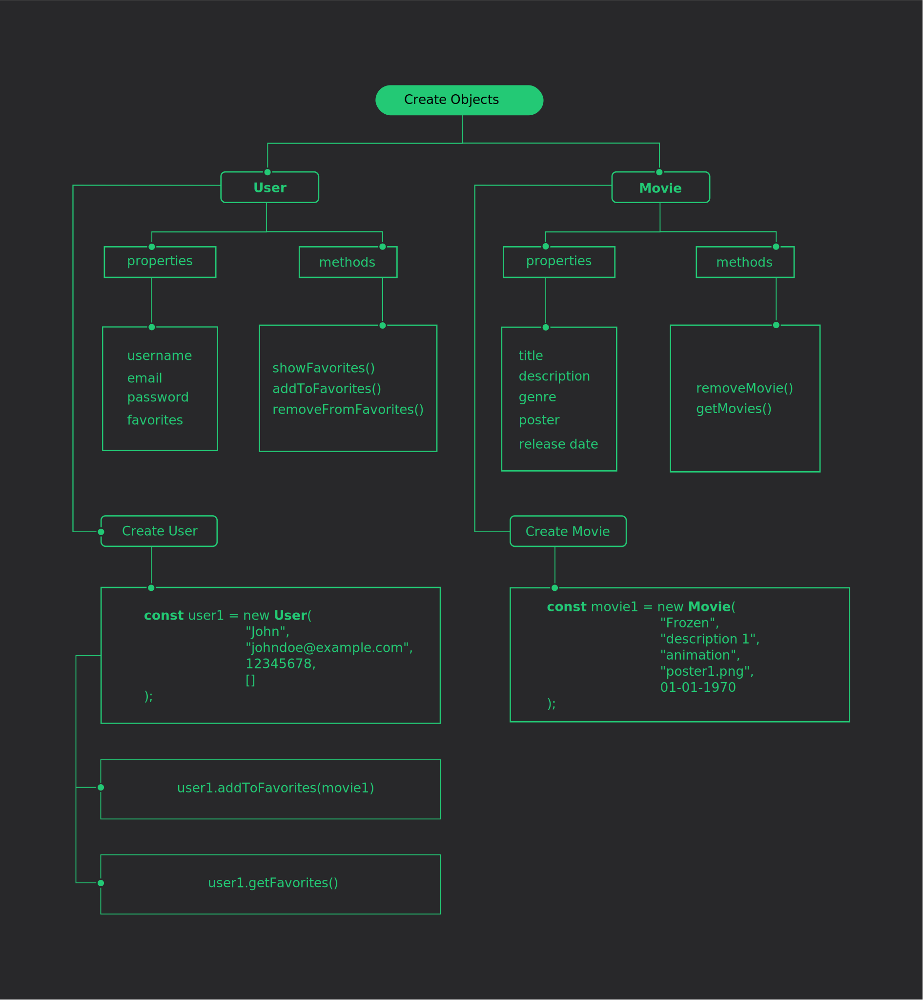

# Object Oriented Programming in JavaScript

This is a discussion on:

-  object oriented programming
-  reasons to use it
-  applications that would benefit from OOP

## Table of contents

-  [Overview](#overview)
   -  [What is OOP?](#what-is-oop)
   -  [Why would you use it?](#why-would-you-use-it)
   -  [When would you use OOP patterns?](#when-would-you-use-oop-patterns)
   -  [Example OOP project](#example-oop-project)
   -  [Images](#images)
-  [My process](#my-process)
   -  [Built with](#built-with)
   -  [What I learned](#what-i-learned)
   -  [Continued development](#continued-development)
   -  [Useful resources](#useful-resources)
-  [Author](#author)

## Overview

### What is OOP?

The basic idea of **object oriented programming** is that we can use **objects** to model real world things. These **objects** can have data and other code to represent important information about the thing you are trying to model.

### Why would you use it?

**Objects** have their own properties and functions (known as **methods**) which can be stored neatly inside an object package, making it easy to structure and access. **Objects** are also commonly used as data stores that can be easily sent across a network.

### When would you use OOP patterns?

When you need to solve complex programming challenges and want to add code tools to your skill set, OOP is a great choice, because it allows you to break down your project into bite-sized problems that you can then solve - one object at a time.

### Example OOP project

A movie database is one type of application you can build that would benefit greatly from an OOP structure.
Users of such a database can use the application to:

-  Browse available movies
-  Search for movies
-  See a particular movie's details
-  View movies in a favorites list
-  Add movies to a favorites list
-  Remove movies from a favorites list

### Images

An example image depicting an **OOP** structure for a movie database.

What's in view:

-  **Objects** that would be in such an application
-  **Properties** that such **Objects** would have
-  **Methods** that would be found in such **objects**
-  How the **objects** can be instantiated using the **new** keyword

## My process

### Built with

-  [Inkscape](https://inkscape.org)

### What I learned

-  With the power of **encapsulation** locating and fixing problems is much easier when using an **OOP** approach.
-  **inheritance** makes it is easy to reuse code.

### Continued development

-  I want to understand **OOP** better by using it more in projects. That would, in turn, help me improve my problem solving skills.

### Useful resources

-  [Inkscape](https://inkscape.org) - Inkscape SVG Editor. I use it all the time when I'm working on any web project.

## Author

-  Github - [Allan Kirui](https://www.github.com/AllanKirui)
-  Instagram - [@nallawilljr](https://www.instagram.com/nallawilljr)
